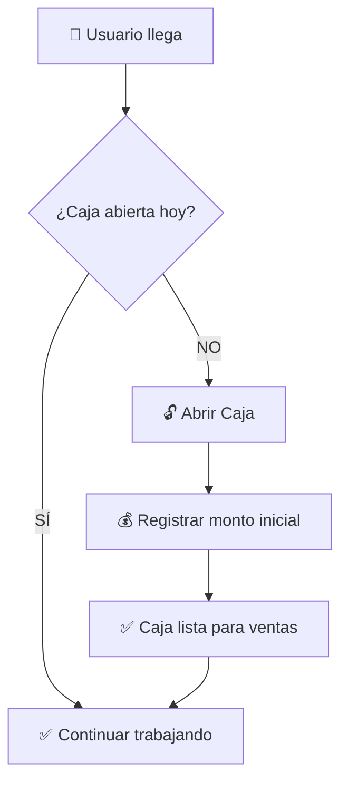
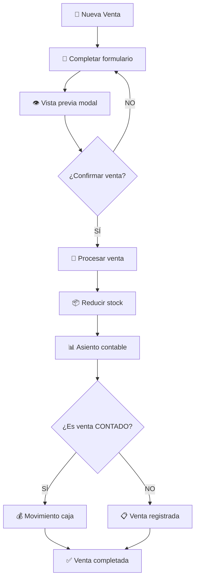
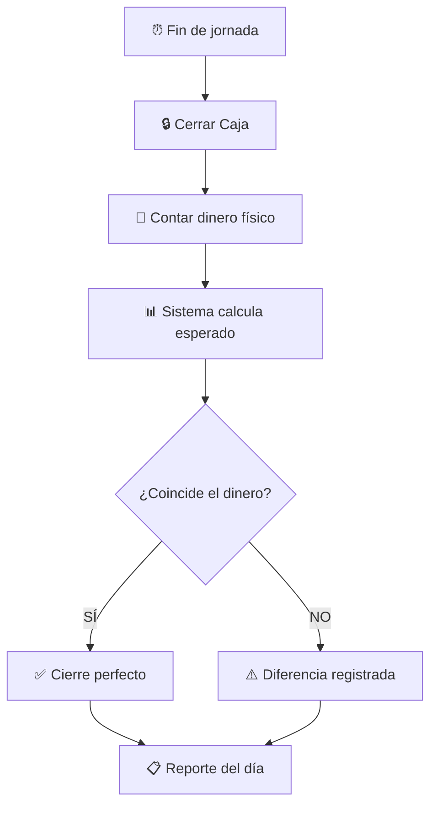

# 💰 FLUJO COMPLETO DE VENTAS CON SISTEMA DE CAJAS

## 🎯 CONCEPTO GENERAL

El sistema de cajas en la distribuidora funciona con **apertura y cierre diarios por usuario**. Cada usuario debe abrir su caja al inicio del día laboral y cerrarla al final. Las ventas al contado se registran automáticamente en la caja del usuario que realiza la venta.

## 🔄 FLUJO DIARIO COMPLETO

### **📅 INICIO DEL DÍA**



1. **Usuario llega al trabajo**
2. **Verificar si tiene caja abierta** para el día actual
3. **Si NO tiene caja abierta:**
   - Abrir caja con monto inicial
   - Registrar observaciones (opcional)
   - Sistema crea registro en `aperturas_caja`
4. **Si YA tiene caja abierta:**
   - Continuar con las operaciones normales

### **🛒 DURANTE EL DÍA - VENTAS**



**Automatizaciones por cada venta:**

1. **Reducción de Stock** (automática vía `StockService`)
2. **Asiento Contable** (automático vía eventos del modelo)
3. **Movimiento de Caja** (solo para ventas al contado):
   - Se busca la caja abierta del usuario para el día actual
   - Se crea movimiento de entrada (+) por el total de la venta
   - Se vincula con el número de documento de venta

### **🌅 FIN DEL DÍA**



1. **Contar dinero físico** en caja
2. **Sistema calcula monto esperado:**
   - Monto inicial + Total ventas contado - Gastos
3. **Registrar monto real** contado
4. **Sistema calcula diferencia** automáticamente
5. **Generar reporte del día**

## 📊 ESTRUCTURA DE DATOS

### **🏦 Tabla: `cajas`**

```sql
- id: Identificador único
- nombre: "Caja Principal", "Caja Secundaria"
- ubicacion: "Mostrador", "Almacén"
- monto_inicial_dia: Monto base diario
- activa: true/false
```

### **🔓 Tabla: `aperturas_caja`**

```sql
- id: Identificador único
- caja_id: FK a cajas
- user_id: FK a users (IMPORTANTE: por usuario)
- fecha: DateTime de apertura
- monto_apertura: Dinero inicial del día
- observaciones: Notas del usuario
```

### **🔒 Tabla: `cierres_caja`**

```sql
- id: Identificador único
- caja_id: FK a cajas
- user_id: FK a users
- apertura_caja_id: FK a la apertura correspondiente
- fecha: DateTime de cierre
- monto_esperado: Lo que debería haber (calculado)
- monto_real: Lo que realmente hay (contado)
- diferencia: monto_real - monto_esperado
- observaciones: Explicación de diferencias
```

### **💸 Tabla: `movimientos_caja`**

```sql
- id: Identificador único
- caja_id: FK a cajas
- tipo_operacion_id: FK (VENTA, GASTO, OTROS)
- numero_documento: Número de venta/comprobante
- descripcion: Detalle del movimiento
- monto: + para entradas, - para salidas
- fecha: DateTime del movimiento
- user_id: Usuario responsable
```

## 🎯 RESPUESTAS A TUS PREGUNTAS

### **❓ ¿Las cajas serán por usuario?**

**✅ SÍ, exactamente.** El sistema está diseñado para que:

1. **Cada usuario** tenga su propia responsabilidad de caja
2. **Una caja física** puede ser usada por **múltiples usuarios** en diferentes turnos
3. **La apertura/cierre** se hace **por usuario y por día**
4. **Cada venta** se registra en la caja del **usuario que la realiza**

### **❓ ¿Necesito aperturar cajas diariamente?**

**✅ SÍ, es obligatorio.** Para realizar ventas al contado:

1. **Usuario DEBE** tener caja abierta para el día actual
2. **Sin caja abierta** = ventas al contado NO se registran en caja
3. **El sistema verifica** automáticamente si hay caja abierta
4. **Si no hay caja abierta** = warning en logs, pero venta se completa

## 🔧 IMPLEMENTACIÓN ACTUAL VS NECESARIA

### **✅ YA IMPLEMENTADO**

- ✅ Modelos completos (`Caja`, `AperturaCaja`, `CierreCaja`)
- ✅ Migraciones de base de datos
- ✅ Relaciones entre modelos
- ✅ Lógica automática en ventas para movimientos de caja
- ✅ Verificación de caja abierta en ventas
- ✅ Logging de errores y warnings

### **❌ FALTA IMPLEMENTAR**

- ❌ **Controller para gestión de cajas** (`CajaController` está vacío)
- ❌ **Rutas para apertura/cierre de cajas**
- ❌ **Interfaces frontend** para apertura/cierre
- ❌ **Dashboard de estado de cajas**
- ❌ **Reportes de movimientos de caja**

## 🛠️ PRÓXIMOS PASOS SUGERIDOS

### **1. Implementar CajaController (Prioridad ALTA)**

```php
class CajaController extends Controller 
{
    public function abrirCaja(Request $request) { }
    public function cerrarCaja(Request $request) { }
    public function estadoCajas() { }
    public function movimientosDia() { }
}
```

### **2. Crear Rutas (Prioridad ALTA)**

```php
Route::group(['prefix' => 'cajas'], function() {
    Route::get('/', 'CajaController@index');
    Route::post('/abrir', 'CajaController@abrirCaja');
    Route::post('/cerrar', 'CajaController@cerrarCaja');
    Route::get('/estado', 'CajaController@estadoCajas');
    Route::get('/movimientos', 'CajaController@movimientosDia');
});
```

### **3. Interfaces Frontend (Prioridad MEDIA)**

- **Modal de apertura de caja** (inicio de día)
- **Modal de cierre de caja** (fin de día)
- **Dashboard de estado de cajas**
- **Reporte de movimientos diarios**

### **4. Validaciones y Middleware (Prioridad MEDIA)**

- **Middleware** para verificar caja abierta antes de ventas
- **Validaciones** de montos y fechas
- **Prevención** de múltiples aperturas por día

## 📈 FLUJO VISUAL SIMPLIFICADO

```
👤 USUARIO          🏦 SISTEMA DE CAJAS          🛒 VENTAS
   |                        |                        |
   |---> 🔓 Abrir Caja ---->|                        |
   |                        |---> ✅ Caja Lista      |
   |                        |                        |
   |-----------------------------------------> 🛒 Nueva Venta
   |                        |                        |
   |                        |<---- 💰 Movimiento ---|
   |                        |                        |
   |---> 🔒 Cerrar Caja --->|                        |
   |                        |---> 📊 Reporte        |
```

## 🎯 RECOMENDACIÓN INMEDIATA

**Para que el sistema funcione completamente:**

1. **Implementar CajaController** con apertura/cierre
2. **Crear las rutas** correspondientes  
3. **Desarrollar interfaces frontend** básicas
4. **Agregar validación** de caja abierta en ventas

¿Te gustaría que implemente el **CajaController** y las **rutas básicas** para completar este flujo?
