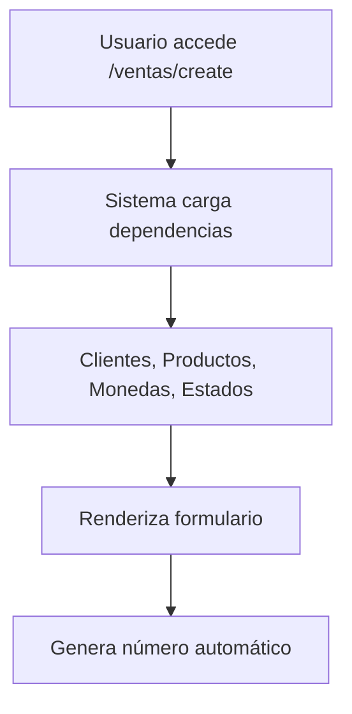
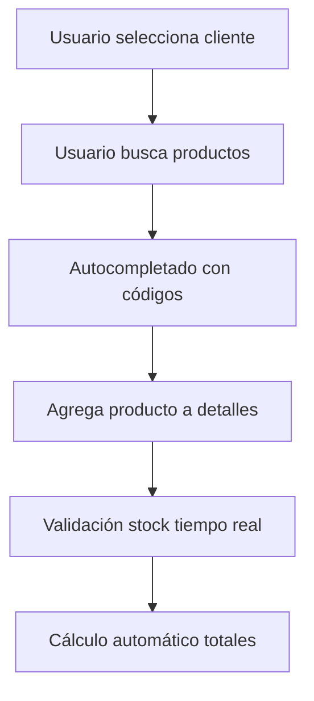
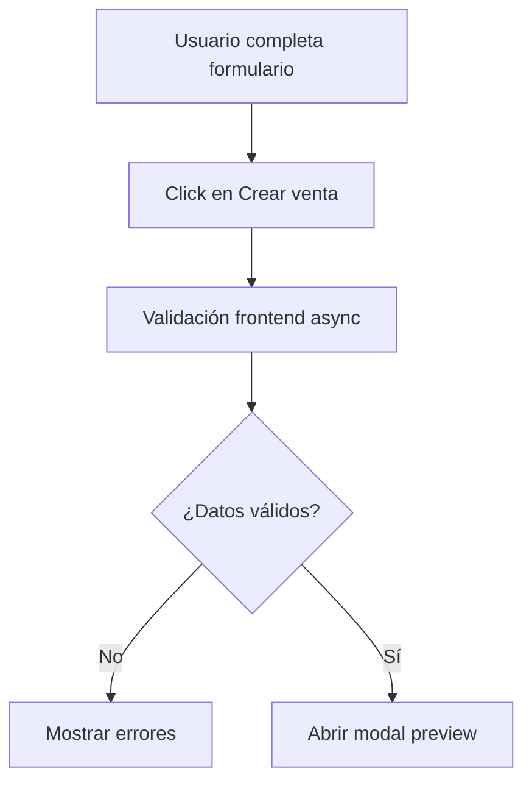
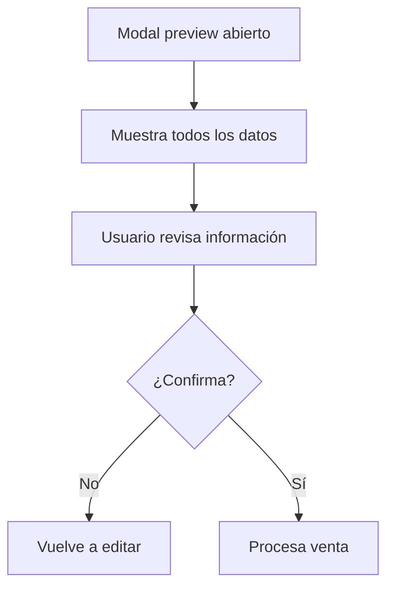
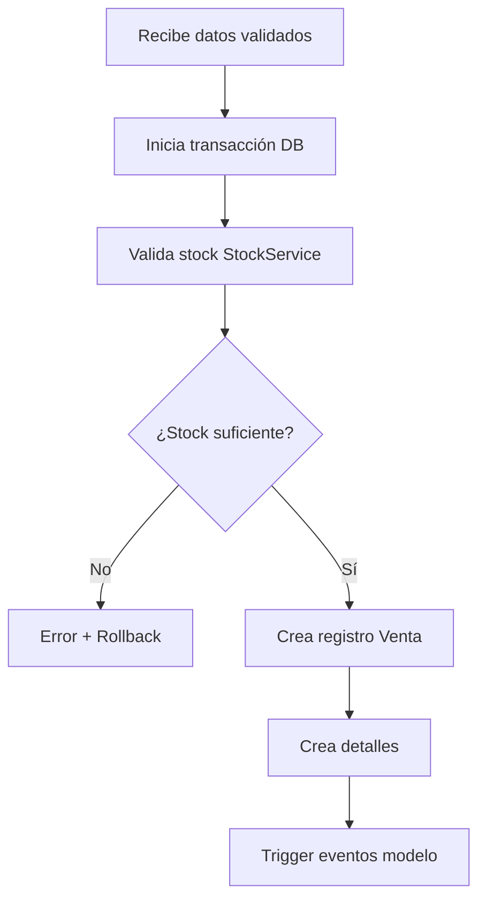
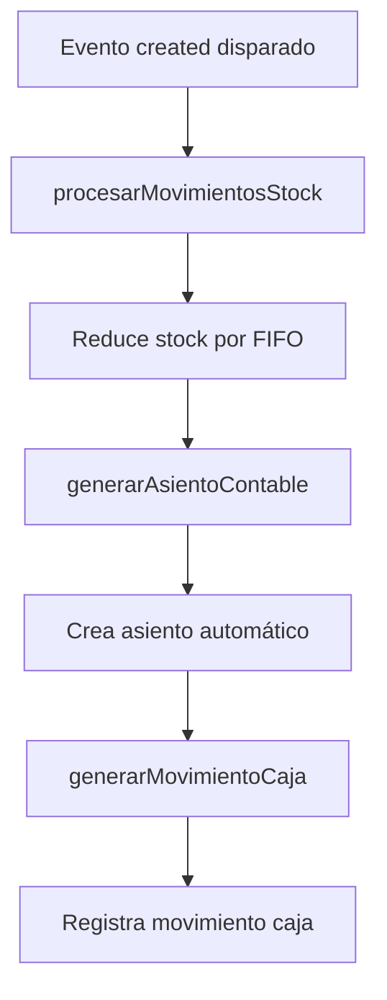
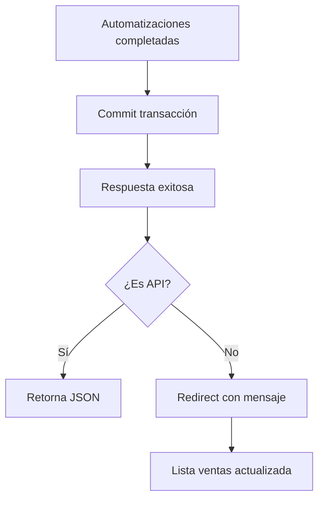

# 🛍️ FLUJO DE TRABAJO - MÓDULO DE VENTAS

## 📋 ÍNDICE

1. [Arquitectura General](#arquitectura-general)
2. [Flujo de Datos](#flujo-de-datos)
3. [Casos de Uso](#casos-de-uso)
4. [APIs y Endpoints](#apis-y-endpoints)
5. [Frontend Components](#frontend-components)
6. [Automatizaciones](#automatizaciones)
7. [Flujo Completo Paso a Paso](#flujo-completo-paso-a-paso)

---

## 🏗️ ARQUITECTURA GENERAL

### Estructura del Módulo

```
app/
├── Http/Controllers/
│   ├── VentaController.php              # Controlador principal
│   └── DetalleVentaController.php       # Gestión de detalles
├── Models/
│   ├── Venta.php                        # Modelo principal con eventos
│   ├── DetalleVenta.php                 # Detalles de productos
│   ├── Cliente.php                      # Relación con clientes
│   ├── EstadoDocumento.php              # Estados de venta
│   └── Moneda.php                       # Monedas disponibles
├── Services/
│   └── StockService.php                 # Gestión automática de stock
├── Http/Requests/
│   ├── StoreVentaRequest.php            # Validación creación
│   └── UpdateVentaRequest.php           # Validación actualización
└── Observers/
    └── VentaObserver.php                # Eventos automatizados
```

```
resources/js/
├── Pages/ventas/
│   ├── index.tsx                        # Lista de ventas
│   ├── create.tsx                       # Formulario creación/edición
│   └── show.tsx                         # Vista detallada
├── components/
│   └── VentaPreviewModal.tsx            # Modal vista previa
├── domain/
│   └── ventas.ts                        # Tipos TypeScript
└── services/
    └── ventas.service.ts                # Servicio frontend
```

---

## 🔄 FLUJO DE DATOS

### 1. **Entrada de Datos**

```
Usuario → Formulario → Validación → Controlador → Modelo
```

### 2. **Procesamiento**

```
Modelo → Eventos → Automatizaciones → Base de Datos
```

### 3. **Respuesta**

```
Base de Datos → Controlador → JSON/Inertia → Frontend → Usuario
```

---

## 🎯 CASOS DE USO

### 📝 **UC01: Crear Nueva Venta**

**Actor:** Usuario autorizado
**Flujo Principal:**

1. Usuario accede a `/ventas/create`
2. Selecciona cliente y datos básicos
3. Agrega productos con cantidades
4. Sistema valida stock en tiempo real
5. Usuario revisa en modal de vista previa
6. Confirma creación
7. Sistema procesa automatizaciones

### 👀 **UC02: Ver Lista de Ventas**

**Actor:** Usuario autorizado
**Flujo Principal:**

1. Usuario accede a `/ventas`
2. Sistema muestra lista paginada
3. Usuario puede filtrar y buscar
4. Acceso a acciones individuales

### 🔍 **UC03: Ver Detalle de Venta**

**Actor:** Usuario autorizado
**Flujo Principal:**

1. Usuario selecciona venta desde lista
2. Sistema muestra información completa
3. Histórico de pagos y movimientos
4. Enlaces a documentos relacionados

### ✏️ **UC04: Editar Venta**

**Actor:** Usuario autorizado
**Flujo Principal:**

1. Usuario selecciona editar venta
2. Sistema carga datos existentes
3. Usuario modifica información
4. Sistema actualiza con validaciones
5. Automatizaciones se reajustan

### 🗑️ **UC05: Eliminar Venta**

**Actor:** Usuario autorizado
**Flujo Principal:**

1. Usuario confirma eliminación
2. Sistema revierte movimientos
3. Elimina registros relacionados
4. Confirma operación

---

## 🔌 APIS Y ENDPOINTS

### **Rutas Web (Inertia.js)**

```php
// CRUD Básico
GET    /ventas              # Lista de ventas
GET    /ventas/create       # Formulario creación
POST   /ventas              # Crear venta
GET    /ventas/{id}         # Ver detalle
GET    /ventas/{id}/edit    # Formulario edición
PUT    /ventas/{id}         # Actualizar
DELETE /ventas/{id}         # Eliminar

// Funcionalidades Especiales
GET    /ventas/stock/{producto}  # Verificar stock
```

### **Rutas API (JSON)**

```php
// Mismas rutas con header Accept: application/json
POST   /api/ventas/verificar-stock     # Validación stock múltiple
GET    /api/ventas/{id}/resumen-stock  # Resumen stock venta
GET    /api/ventas/productos-stock-bajo # Productos con stock bajo
```

### **Endpoints del Controlador**

#### `VentaController::index()`

- **Entrada:** Parámetros de filtro opcionales
- **Salida:** Lista paginada de ventas con relaciones
- **Formato:** Inertia render o JSON

#### `VentaController::create()`

- **Entrada:** Ninguna
- **Salida:** Formulario con datos precargados
- **Datos incluidos:** Clientes, Productos, Monedas, Estados

#### `VentaController::store(StoreVentaRequest)`

- **Entrada:** Datos validados de venta
- **Procesamiento:** Transacción completa con automatizaciones
- **Salida:** Venta creada con confirmación

#### `VentaController::show($id)`

- **Entrada:** ID de venta
- **Salida:** Venta completa con relaciones
- **Incluye:** Detalles, Cliente, Pagos, Cuenta por Cobrar

#### `VentaController::verificarStock(Request)`

- **Entrada:** Array de productos y cantidades
- **Procesamiento:** Validación usando StockService
- **Salida:** Estado de validación y detalles

---

## ⚛️ FRONTEND COMPONENTS

### **Páginas Principales**

#### `ventas/index.tsx`

- **Propósito:** Lista principal de ventas
- **Características:**
  - Tabla responsive con paginación
  - Filtros por fecha, cliente, estado
  - Acciones: Ver, Editar, Eliminar
  - Links a creación

#### `ventas/create.tsx`

- **Propósito:** Formulario creación/edición
- **Características:**
  - Validación en tiempo real
  - Búsqueda dinámica de productos
  - Cálculo automático de totales
  - Vista previa antes de confirmar
  - Estado defensivo para props undefined

#### `ventas/show.tsx`

- **Propósito:** Vista detallada de venta
- **Características:**
  - Información completa
  - Histórico de movimientos
  - Enlaces a documentos
  - Acciones contextuales

### **Componentes Reutilizables**

#### `VentaPreviewModal.tsx`

- **Propósito:** Modal de confirmación
- **Características:**
  - Vista completa de datos
  - Diseño responsive
  - Soporte tema claro/oscuro
  - Animaciones suaves

---

## 🤖 AUTOMATIZACIONES

### **Event Listeners en Modelo Venta**

#### `created` Event

```php
static::created(function ($venta) {
    $venta->procesarMovimientosStock();    // Reduce stock automáticamente
    $venta->generarAsientoContable();      // Crea asiento contable
    $venta->generarMovimientoCaja();       // Registra en caja
});
```

#### `deleting` Event

```php
static::deleting(function ($venta) {
    $venta->revertirMovimientosStock();    // Devuelve stock
    $venta->eliminarAsientoContable();     // Elimina asiento
});
```

### **StockService Automatizaciones**

#### Validación FIFO

```php
public function validarStockDisponible($productos, $almacenId = null)
{
    // Valida disponibilidad con lógica FIFO
    // Retorna errores específicos por producto
}
```

#### Procesamiento de Salida

```php
public function procesarSalidaVenta($ventaId)
{
    // Procesa salidas por lotes FIFO
    // Actualiza stock automáticamente
}
```

---

## 🚀 FLUJO COMPLETO PASO A PASO

### **1. INICIO DE VENTA**



**Código involucrado:**

- `VentaController::create()`
- `resources/js/Pages/ventas/create.tsx`
- Props: clientes, productos, monedas, estados_documento

### **2. SELECCIÓN DE DATOS**



**Funciones clave:**

- `addProductToDetail()`
- `updateDetail()`
- `calculateTotals()`

### **3. VALIDACIÓN PREVIA**



**Validaciones:**

- `ventasService.validateData(data)`
- Campos obligatorios
- Productos mínimos
- Stock disponible

### **4. VISTA PREVIA**



**Componente:** `VentaPreviewModal.tsx`
**Datos mostrados:**

- Información documento
- Datos cliente
- Lista productos
- Resumen totales

### **5. PROCESAMIENTO BACKEND**



**Controller:** `VentaController::store()`
**Flujo transaccional completo**

### **6. AUTOMATIZACIONES**



**Servicios involucrados:**

- `StockService::procesarSalidaVenta()`
- `AsientoContableService`
- `CajaService`

### **7. RESPUESTA Y CONFIRMACIÓN**



**Confirmaciones:**

- Toast notification
- Redirect a `/ventas`
- Información stock actualizada

---

## 📊 ESTADOS Y TRANSICIONES

### **Estados de Venta**

- **BORRADOR**: Venta en construcción
- **CONFIRMADA**: Venta procesada
- **PAGADA**: Pagos completados
- **CANCELADA**: Venta anulada

### **Flujo de Estados**

```
BORRADOR → CONFIRMADA → PAGADA
    ↓           ↓
CANCELADA ← CANCELADA
```

---

## 🔐 SEGURIDAD Y PERMISOS

### **Permisos Requeridos**

```php
// Middleware en VentaController
'permission:ventas.index'     // Ver lista
'permission:ventas.create'    // Crear nueva
'permission:ventas.store'     // Guardar
'permission:ventas.show'      // Ver detalle
'permission:ventas.edit'      // Editar
'permission:ventas.update'    // Actualizar
'permission:ventas.destroy'   // Eliminar
'permission:ventas.verificar-stock' // Verificar stock
```

### **Validaciones de Seguridad**

- CSRF tokens automáticos
- Validación de permisos por ruta
- Sanitización de inputs
- Validación de relaciones (cliente existe, etc.)

---

## 🧪 TESTING

### **Tests Unitarios**

- Modelo Venta events
- StockService lógica FIFO
- Validaciones de requests

### **Tests de Integración**

- Flujo completo creación venta
- Automatizaciones correctas
- Rollback en errores

### **Tests Frontend**

- Validación formularios
- Modal preview
- Cálculos automáticos

---

## 📈 MÉTRICAS Y MONITOREO

### **Logs Automáticos**

- Creación de ventas
- Errores de stock
- Automatizaciones fallidas

### **Métricas de Performance**

- Tiempo respuesta crear venta
- Validaciones de stock
- Carga de dependencias

---

## 🔧 CONFIGURACIÓN

### **Variables Importantes**

```env
# Configuración de ventas
STOCK_VALIDATION_ENABLED=true
CONTABILIDAD_AUTO=true
CAJA_AUTO=true
```

### **Configuración Frontend**

```typescript
// ventas.service.ts
const API_BASE = '/ventas';
const VALIDATION_TIMEOUT = 5000;
```

---

## 📝 CHANGELOG Y VERSIONES

### **v1.3.0 - Actual**

- ✅ Modal de vista previa implementado
- ✅ Validación defensiva props undefined
- ✅ Automatizaciones stock/contabilidad/caja
- ✅ TypeScript completo

### **Próximas Mejoras**

- 🚧 Facturación electrónica SIN
- 🚧 Sistema de auditoría completo
- 🚧 Reportes avanzados de ventas

---

**Documentación generada:** ${new Date().toLocaleDateString('es-BO')}
**Sistema:** Distribuidora Paucara - Módulo Ventas
**Estado:** ✅ Funcional al 95% - Modal implementado exitosamente
