# 📱 SISTEMA DE VENTAS CON APP EXTERNA Y LOGÍSTICA

## 🎯 ANÁLISIS DEL FLUJO REQUERIDO

### **📋 Proceso Completo:**

```mermaid
graph TD
    A[📱 Cliente App Flutter] --> B[🛒 Solicita Proforma]
    B --> C[📧 Notificación a Encargado]
    C --> D{🔍 Encargado Revisa}
    D -->|✅ Aprueba| E[📄 Genera Proforma]
    D -->|❌ Rechaza| F[🚫 Notifica Rechazo]
    E --> G{💳 Cliente Acepta?}
    G -->|✅ Sí| H[💰 Convierte a Venta]
    G -->|❌ No| I[📝 Queda como Proforma]
    H --> J[📦 Preparar Pedido]
    J --> K[🚛 Asignar Vehículo]
    K --> L[👨‍💼 Asignar Chofer]
    L --> M[🛣️ En Ruta]
    M --> N[📍 Entregado]
    N --> O[✅ Confirmar Entrega]
    O --> P[📊 Actualizar Stock]
```



## 🏗️ ARQUITECTURA DE LA SOLUCIÓN

### **📚 Nuevos Modelos Necesarios:**

#### **1. Proforma (Cotizaciones)**

```php
// app/Models/Proforma.php
class Proforma extends Model
{
    protected $fillable = [
        'numero',
        'fecha',
        'fecha_vencimiento',
        'subtotal',
        'descuento', 
        'impuesto',
        'total',
        'estado', // PENDIENTE, APROBADA, RECHAZADA, CONVERTIDA, VENCIDA
        'observaciones',
        'observaciones_rechazo',
        'cliente_id',
        'usuario_creador_id',
        'usuario_aprobador_id',
        'fecha_aprobacion',
        'moneda_id',
        'canal_origen', // APP_EXTERNA, WEB, PRESENCIAL
    ];

    // Estados
    const PENDIENTE = 'PENDIENTE';
    const APROBADA = 'APROBADA';
    const RECHAZADA = 'RECHAZADA';
    const CONVERTIDA = 'CONVERTIDA';
    const VENCIDA = 'VENCIDA';

    // Relaciones
    public function detalles() {
        return $this->hasMany(DetalleProforma::class);
    }
    
    public function cliente() {
        return $this->belongsTo(Cliente::class);
    }
    
    public function usuarioCreador() {
        return $this->belongsTo(User::class, 'usuario_creador_id');
    }
    
    public function usuarioAprobador() {
        return $this->belongsTo(User::class, 'usuario_aprobador_id');
    }
    
    public function venta() {
        return $this->hasOne(Venta::class);
    }
}
```

#### **2. Envío/Logística**

```php
// app/Models/Envio.php
class Envio extends Model
{
    protected $fillable = [
        'numero_envio',
        'venta_id',
        'vehiculo_id',
        'chofer_id',
        'fecha_programada',
        'fecha_salida',
        'fecha_entrega',
        'estado', // PROGRAMADO, EN_PREPARACION, EN_RUTA, ENTREGADO, CANCELADO
        'direccion_entrega',
        'coordenadas_lat',
        'coordenadas_lng',
        'observaciones',
        'foto_entrega',
        'firma_cliente',
        'receptor_nombre',
        'receptor_documento',
    ];

    // Estados
    const PROGRAMADO = 'PROGRAMADO';
    const EN_PREPARACION = 'EN_PREPARACION';
    const EN_RUTA = 'EN_RUTA';
    const ENTREGADO = 'ENTREGADO';
    const CANCELADO = 'CANCELADO';

    // Relaciones
    public function venta() {
        return $this->belongsTo(Venta::class);
    }
    
    public function vehiculo() {
        return $this->belongsTo(Vehiculo::class);
    }
    
    public function chofer() {
        return $this->belongsTo(User::class, 'chofer_id');
    }
    
    public function seguimientos() {
        return $this->hasMany(SeguimientoEnvio::class);
    }
}
```

#### **3. Vehículos**

```php
// app/Models/Vehiculo.php
class Vehiculo extends Model
{
    protected $fillable = [
        'placa',
        'marca',
        'modelo',
        'capacidad_kg',
        'capacidad_volumen',
        'estado', // DISPONIBLE, EN_RUTA, MANTENIMIENTO, FUERA_SERVICIO
        'chofer_asignado_id',
        'observaciones',
    ];

    // Estados
    const DISPONIBLE = 'DISPONIBLE';
    const EN_RUTA = 'EN_RUTA';
    const MANTENIMIENTO = 'MANTENIMIENTO';
    const FUERA_SERVICIO = 'FUERA_SERVICIO';
}
```

#### **4. Seguimiento en Tiempo Real**

```php
// app/Models/SeguimientoEnvio.php
class SeguimientoEnvio extends Model
{
    protected $fillable = [
        'envio_id',
        'estado',
        'coordenadas_lat',
        'coordenadas_lng',
        'fecha_hora',
        'observaciones',
        'foto',
        'user_id',
    ];
}
```

## 🔄 MODIFICACIONES AL SISTEMA ACTUAL

### **📝 Modelo Venta Extendido**

```php
// Agregar a app/Models/Venta.php
protected $fillable = [
    // ... campos existentes ...
    'proforma_id',        // NUEVO: Relación con proforma
    'requiere_envio',     // NUEVO: boolean
    'canal_origen',       // NUEVO: APP_EXTERNA, WEB, PRESENCIAL
    'estado_logistico',   // NUEVO: PENDIENTE_ENVIO, PREPARANDO, ENVIADO, ENTREGADO
];

// Nuevas relaciones
public function proforma() {
    return $this->belongsTo(Proforma::class);
}

public function envio() {
    return $this->hasOne(Envio::class);
}

// Nuevos métodos
public function puedeEnviarse(): bool
{
    return $this->requiere_envio && 
           $this->estado_logistico === 'PENDIENTE_ENVIO' &&
           $this->estado_documento_id === EstadoDocumento::CONFIRMADO;
}

public function programarEnvio(array $datos): Envio
{
    return Envio::create([
        'venta_id' => $this->id,
        'vehiculo_id' => $datos['vehiculo_id'],
        'chofer_id' => $datos['chofer_id'],
        'fecha_programada' => $datos['fecha_programada'],
        'direccion_entrega' => $this->cliente->direccion,
        'estado' => Envio::PROGRAMADO,
    ]);
}
```

### **🎮 Nuevos Controladores**

#### **1. ProformaController**

```php
// app/Http/Controllers/ProformaController.php
class ProformaController extends Controller
{
    public function index()
    {
        $proformas = Proforma::with(['cliente', 'usuarioCreador'])
            ->orderBy('created_at', 'desc')
            ->paginate(20);
            
        return Inertia::render('Proformas/Index', compact('proformas'));
    }

    public function store(Request $request)
    {
        // Crear proforma desde app externa
        DB::beginTransaction();
        try {
            $proforma = Proforma::create([
                'numero' => $this->generarNumeroProforma(),
                'fecha' => now(),
                'fecha_vencimiento' => now()->addDays(7),
                'cliente_id' => $request->cliente_id,
                'usuario_creador_id' => $request->usuario_creador_id ?? null,
                'estado' => Proforma::PENDIENTE,
                'canal_origen' => 'APP_EXTERNA',
                'subtotal' => $request->subtotal,
                'descuento' => $request->descuento ?? 0,
                'impuesto' => $request->impuesto ?? 0,
                'total' => $request->total,
                'moneda_id' => $request->moneda_id,
            ]);

            foreach ($request->detalles as $detalle) {
                $proforma->detalles()->create($detalle);
            }

            // Notificar a encargados
            $this->notificarNuevaProforma($proforma);

            DB::commit();
            return response()->json(['proforma' => $proforma], 201);
        } catch (\Exception $e) {
            DB::rollBack();
            return response()->json(['error' => $e->getMessage()], 500);
        }
    }

    public function aprobar(Proforma $proforma, Request $request)
    {
        $request->validate([
            'observaciones' => 'nullable|string|max:500'
        ]);

        $proforma->update([
            'estado' => Proforma::APROBADA,
            'usuario_aprobador_id' => auth()->id(),
            'fecha_aprobacion' => now(),
            'observaciones' => $request->observaciones,
        ]);

        // Notificar al cliente via app
        $this->notificarProformaAprobada($proforma);

        return back()->with('success', 'Proforma aprobada exitosamente');
    }

    public function rechazar(Proforma $proforma, Request $request)
    {
        $request->validate([
            'observaciones_rechazo' => 'required|string|max:500'
        ]);

        $proforma->update([
            'estado' => Proforma::RECHAZADA,
            'usuario_aprobador_id' => auth()->id(),
            'fecha_aprobacion' => now(),
            'observaciones_rechazo' => $request->observaciones_rechazo,
        ]);

        // Notificar al cliente via app
        $this->notificarProformaRechazada($proforma);

        return back()->with('success', 'Proforma rechazada');
    }

    public function convertirAVenta(Proforma $proforma, Request $request)
    {
        if ($proforma->estado !== Proforma::APROBADA) {
            return back()->withErrors(['error' => 'Solo se pueden convertir proformas aprobadas']);
        }

        DB::beginTransaction();
        try {
            // Crear venta basada en proforma
            $venta = Venta::create([
                'numero' => $this->generarNumeroVenta(),
                'fecha' => now(),
                'proforma_id' => $proforma->id,
                'cliente_id' => $proforma->cliente_id,
                'usuario_id' => auth()->id(),
                'subtotal' => $proforma->subtotal,
                'descuento' => $proforma->descuento,
                'impuesto' => $proforma->impuesto,
                'total' => $proforma->total,
                'moneda_id' => $proforma->moneda_id,
                'canal_origen' => 'APP_EXTERNA',
                'requiere_envio' => $request->requiere_envio ?? true,
                'estado_logistico' => 'PENDIENTE_ENVIO',
                'tipo_pago_id' => $request->tipo_pago_id,
                'estado_documento_id' => EstadoDocumento::CONFIRMADO,
            ]);

            // Copiar detalles
            foreach ($proforma->detalles as $detalleProforma) {
                $venta->detalles()->create([
                    'producto_id' => $detalleProforma->producto_id,
                    'cantidad' => $detalleProforma->cantidad,
                    'precio_unitario' => $detalleProforma->precio_unitario,
                    'subtotal' => $detalleProforma->subtotal,
                ]);
            }

            // Actualizar proforma
            $proforma->update(['estado' => Proforma::CONVERTIDA]);

            // Generar automatizaciones
            $venta->generarAsientoContable();
            $venta->generarMovimientoCaja();

            // ⚠️ IMPORTANTE: NO reducir stock aún
            // Stock se reduce al confirmar envío

            DB::commit();

            // Notificar al cliente
            $this->notificarVentaCreada($venta);

            return redirect()->route('ventas.show', $venta)
                ->with('success', 'Venta creada exitosamente desde proforma');
        } catch (\Exception $e) {
            DB::rollBack();
            return back()->withErrors(['error' => $e->getMessage()]);
        }
    }
}
```

#### **2. EnvioController**

```php
// app/Http/Controllers/EnvioController.php
class EnvioController extends Controller
{
    public function index()
    {
        $envios = Envio::with(['venta.cliente', 'vehiculo', 'chofer'])
            ->orderBy('fecha_programada', 'desc')
            ->paginate(20);
            
        return Inertia::render('Envios/Index', compact('envios'));
    }

    public function programar(Venta $venta, Request $request)
    {
        $request->validate([
            'vehiculo_id' => 'required|exists:vehiculos,id',
            'chofer_id' => 'required|exists:users,id',
            'fecha_programada' => 'required|date|after:now',
        ]);

        if (!$venta->puedeEnviarse()) {
            return back()->withErrors(['error' => 'Esta venta no puede enviarse']);
        }

        $envio = $venta->programarEnvio($request->all());

        // Actualizar estado de venta
        $venta->update(['estado_logistico' => 'PREPARANDO']);

        return back()->with('success', 'Envío programado exitosamente');
    }

    public function iniciarPreparacion(Envio $envio)
    {
        $envio->update(['estado' => Envio::EN_PREPARACION]);
        
        // Aquí es donde se reduce el stock
        $this->reducirStockParaEnvio($envio);

        return back()->with('success', 'Preparación iniciada');
    }

    public function confirmarSalida(Envio $envio, Request $request)
    {
        $envio->update([
            'estado' => Envio::EN_RUTA,
            'fecha_salida' => now(),
        ]);

        $envio->venta->update(['estado_logistico' => 'ENVIADO']);

        // Crear seguimiento inicial
        $envio->seguimientos()->create([
            'estado' => 'SALIO_ALMACEN',
            'fecha_hora' => now(),
            'user_id' => auth()->id(),
        ]);

        return back()->with('success', 'Envío confirmado en ruta');
    }

    public function confirmarEntrega(Envio $envio, Request $request)
    {
        $request->validate([
            'receptor_nombre' => 'required|string|max:255',
            'receptor_documento' => 'nullable|string|max:20',
            'foto_entrega' => 'nullable|image|max:2048',
            'firma_cliente' => 'nullable|string', // Base64 de firma
        ]);

        $fotoPath = null;
        if ($request->hasFile('foto_entrega')) {
            $fotoPath = $request->file('foto_entrega')->store('entregas', 'public');
        }

        $envio->update([
            'estado' => Envio::ENTREGADO,
            'fecha_entrega' => now(),
            'receptor_nombre' => $request->receptor_nombre,
            'receptor_documento' => $request->receptor_documento,
            'foto_entrega' => $fotoPath,
            'firma_cliente' => $request->firma_cliente,
        ]);

        $envio->venta->update(['estado_logistico' => 'ENTREGADO']);

        // Crear seguimiento final
        $envio->seguimientos()->create([
            'estado' => 'ENTREGADO',
            'fecha_hora' => now(),
            'observaciones' => 'Entregado a: ' . $request->receptor_nombre,
            'user_id' => auth()->id(),
        ]);

        return back()->with('success', 'Entrega confirmada exitosamente');
    }

    private function reducirStockParaEnvio(Envio $envio)
    {
        $stockService = app(StockService::class);
        
        foreach ($envio->venta->detalles as $detalle) {
            $stockService->reducirStock(
                $detalle->producto_id,
                $detalle->cantidad,
                'ENVIO',
                "Envío #{$envio->numero_envio}"
            );
        }
    }
}
```

## 📱 API PARA APP EXTERNA (Flutter)

### **🔗 Rutas API**

```php
// routes/api.php
Route::middleware(['auth:sanctum'])->group(function () {
    // Productos para la app
    Route::get('/productos', [ApiProductoController::class, 'index']);
    Route::get('/productos/{producto}', [ApiProductoController::class, 'show']);
    
    // Proformas
    Route::post('/proformas', [ApiProformaController::class, 'store']);
    Route::get('/proformas/{proforma}', [ApiProformaController::class, 'show']);
    
    // Cliente puede ver sus proformas y ventas
    Route::get('/cliente/proformas', [ApiClienteController::class, 'proformas']);
    Route::get('/cliente/ventas', [ApiClienteController::class, 'ventas']);
    Route::get('/cliente/envios', [ApiClienteController::class, 'envios']);
    
    // Seguimiento de envíos
    Route::get('/envios/{envio}/seguimiento', [ApiEnvioController::class, 'seguimiento']);
    Route::post('/envios/{envio}/ubicacion', [ApiEnvioController::class, 'actualizarUbicacion']);
});
```

### **📲 Controlador API**

```php
// app/Http/Controllers/Api/ApiProformaController.php
class ApiProformaController extends Controller
{
    public function store(Request $request)
    {
        $request->validate([
            'cliente_id' => 'required|exists:clientes,id',
            'productos' => 'required|array|min:1',
            'productos.*.producto_id' => 'required|exists:productos,id',
            'productos.*.cantidad' => 'required|numeric|min:1',
        ]);

        DB::beginTransaction();
        try {
            // Calcular totales
            $subtotal = 0;
            $productosValidados = [];

            foreach ($request->productos as $item) {
                $producto = Producto::findOrFail($item['producto_id']);
                $cantidad = $item['cantidad'];
                $precio = $producto->precio_venta;
                $subtotalItem = $cantidad * $precio;
                
                $subtotal += $subtotalItem;
                
                $productosValidados[] = [
                    'producto_id' => $producto->id,
                    'cantidad' => $cantidad,
                    'precio_unitario' => $precio,
                    'subtotal' => $subtotalItem,
                ];
            }

            $impuesto = $subtotal * 0.13; // 13% IVA
            $total = $subtotal + $impuesto;

            // Crear proforma
            $proforma = Proforma::create([
                'numero' => $this->generarNumeroProforma(),
                'fecha' => now(),
                'fecha_vencimiento' => now()->addDays(7),
                'cliente_id' => $request->cliente_id,
                'estado' => Proforma::PENDIENTE,
                'canal_origen' => 'APP_EXTERNA',
                'subtotal' => $subtotal,
                'impuesto' => $impuesto,
                'total' => $total,
                'moneda_id' => 1, // Bolivianos por defecto
            ]);

            // Crear detalles
            foreach ($productosValidados as $detalle) {
                $proforma->detalles()->create($detalle);
            }

            // Notificar a encargados
            event(new NuevaProformaCreada($proforma));

            DB::commit();

            return response()->json([
                'success' => true,
                'message' => 'Proforma creada exitosamente',
                'data' => $proforma->load(['detalles.producto', 'cliente'])
            ], 201);

        } catch (\Exception $e) {
            DB::rollBack();
            return response()->json([
                'success' => false,
                'message' => 'Error creando proforma',
                'error' => $e->getMessage()
            ], 500);
        }
    }
}
```

## 🔄 IMPACTO EN CONTROL DE STOCK

### **⚠️ CAMBIO CRÍTICO: Momento de Reducción de Stock**

#### **🔴 ANTES (Sistema actual):**

```php
// Stock se reduce inmediatamente al crear venta
Venta::created(function($venta) {
    $venta->reducirStock(); // ❌ Inmediato
});
```

#### **🟢 DESPUÉS (Nuevo sistema):**

```php
// Stock se reduce cuando se confirma el envío
class EnvioController 
{
    public function iniciarPreparacion(Envio $envio)
    {
        // ✅ Aquí se reduce el stock
        $this->reducirStockParaEnvio($envio);
        
        $envio->update(['estado' => Envio::EN_PREPARACION]);
    }
}
```

### **📊 Nuevo Flujo de Stock:**

1. **🛒 Cliente pide proforma** → No afecta stock
2. **📄 Se crea proforma** → No afecta stock  
3. **✅ Se aprueba proforma** → No afecta stock
4. **💰 Se convierte a venta** → No afecta stock (¡CAMBIO!)
5. **📦 Se programa envío** → No afecta stock
6. **🚛 Se inicia preparación** → ✅ **SE REDUCE STOCK AQUÍ**
7. **🛣️ Sale del almacén** → Stock ya reducido
8. **📍 Se entrega** → Stock ya reducido

### **🎯 Ventajas del Nuevo Flujo:**

- ✅ **Stock real:** Refleja lo que físicamente está en almacén
- ✅ **No bloqueo prematuro:** Productos disponibles hasta preparación
- ✅ **Cancelaciones sin problemas:** Fácil cancelar antes de preparar
- ✅ **Inventario preciso:** Stock = lo que está físicamente disponible

## 📈 TRACKING PARA EL CLIENTE

### **📱 Vista en App Flutter:**

```dart
// Ejemplo de seguimiento en Flutter
class SeguimientoEnvio extends StatelessWidget {
  final Envio envio;

  Widget build(BuildContext context) {
    return Column(
      children: [
        // Timeline visual
        Timeline(
          children: [
            TimelineItem(
              title: "Proforma Aprobada",
              subtitle: envio.venta.proforma.fecha_aprobacion,
              status: TimelineStatus.completed,
              icon: Icons.check_circle,
            ),
            TimelineItem(
              title: "Venta Confirmada", 
              subtitle: envio.venta.created_at,
              status: TimelineStatus.completed,
              icon: Icons.shopping_cart,
            ),
            TimelineItem(
              title: "Preparando Pedido",
              subtitle: envio.estado == 'EN_PREPARACION' ? 'En proceso...' : 'Completado',
              status: envio.estado == 'PROGRAMADO' ? TimelineStatus.pending : TimelineStatus.completed,
              icon: Icons.inventory,
            ),
            TimelineItem(
              title: "En Ruta",
              subtitle: envio.fecha_salida ?? 'Pendiente',
              status: envio.estado == 'EN_RUTA' ? TimelineStatus.active : 
                     envio.estado == 'ENTREGADO' ? TimelineStatus.completed : TimelineStatus.pending,
              icon: Icons.local_shipping,
            ),
            TimelineItem(
              title: "Entregado",
              subtitle: envio.fecha_entrega ?? 'Pendiente',
              status: envio.estado == 'ENTREGADO' ? TimelineStatus.completed : TimelineStatus.pending,
              icon: Icons.check_circle_outline,
            ),
          ],
        ),
        
        // Mapa en tiempo real
        if (envio.estado == 'EN_RUTA')
          MapaEnTiempoReal(envioId: envio.id),
          
        // Información del envío
        InfoEnvio(envio: envio),
      ],
    );
  }
}
```

## 🚀 IMPLEMENTACIÓN PASO A PASO

### **Fase 1: Modelos y Migraciones**

1. ✅ Crear migraciones para proformas, envíos, vehículos
2. ✅ Crear modelos con relaciones
3. ✅ Actualizar modelo Venta
4. ✅ Seeders para datos de prueba

### **Fase 2: Backend Core**

1. ✅ ProformaController completo
2. ✅ EnvioController completo
3. ✅ API para app externa
4. ✅ Modificar flujo de stock

### **Fase 3: Frontend Web**

1. ✅ Páginas de gestión de proformas
2. ✅ Dashboard de envíos
3. ✅ Panel de seguimiento
4. ✅ Integración con módulo ventas

### **Fase 4: App Externa**

1. ✅ API endpoints completos
2. ✅ Documentación API
3. ✅ Testing de integración

### **Fase 5: Funciones Avanzadas**

1. ✅ Notificaciones push
2. ✅ Tracking GPS en tiempo real
3. ✅ Reportes de logística
4. ✅ Dashboard gerencial

¿Te gustaría que comience implementando alguna fase específica? ¿O prefieres que empiece con los modelos y migraciones básicas?
