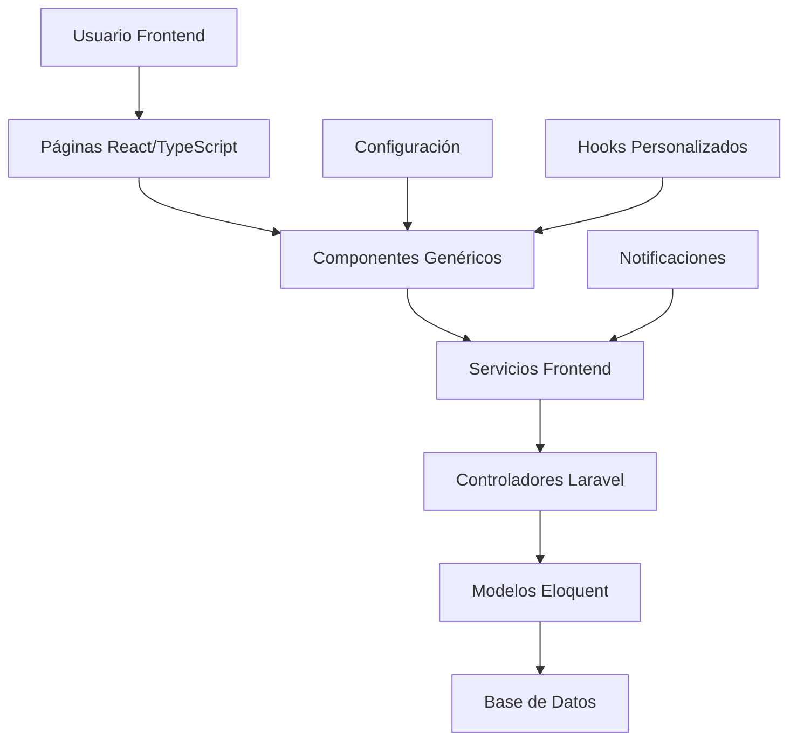
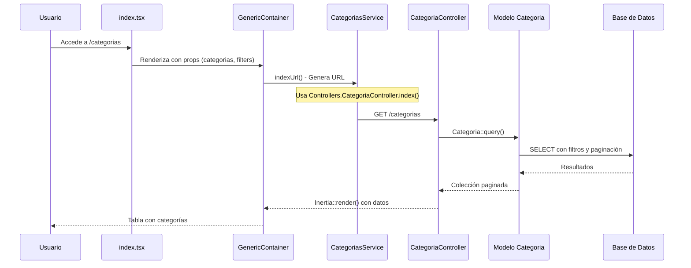
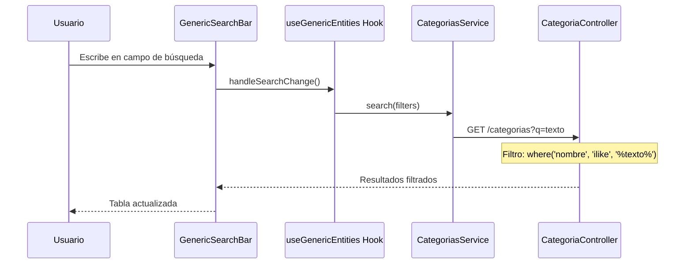
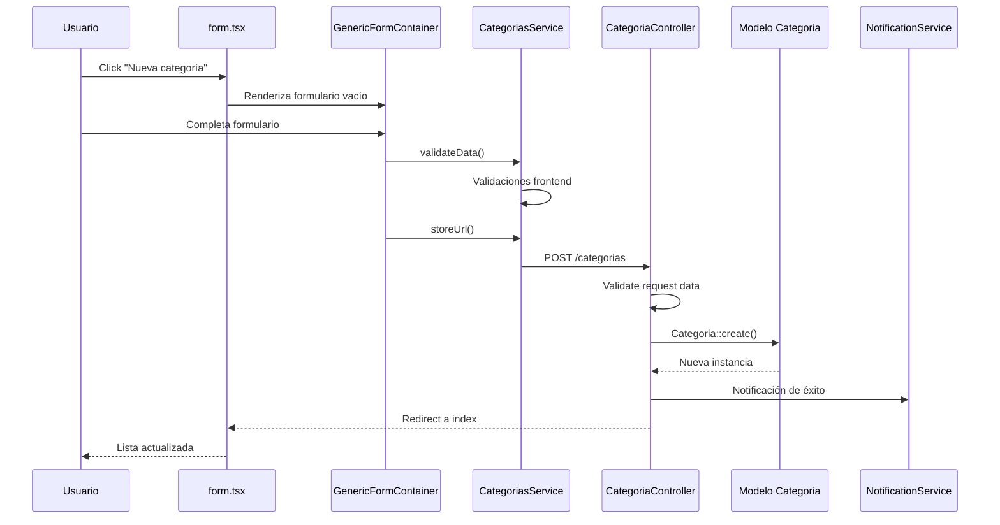
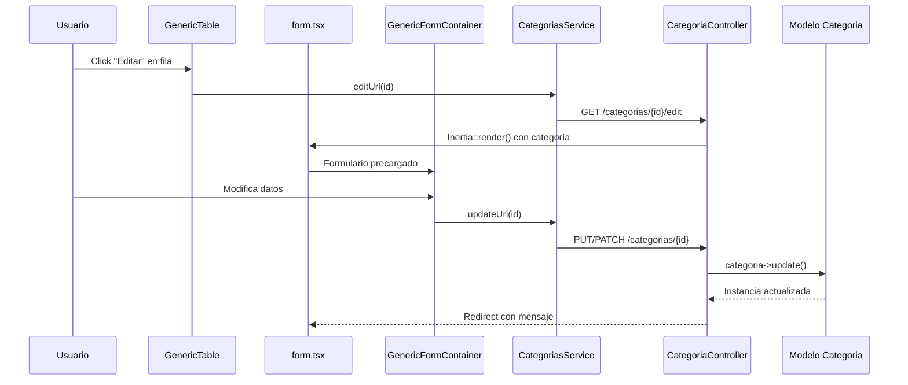
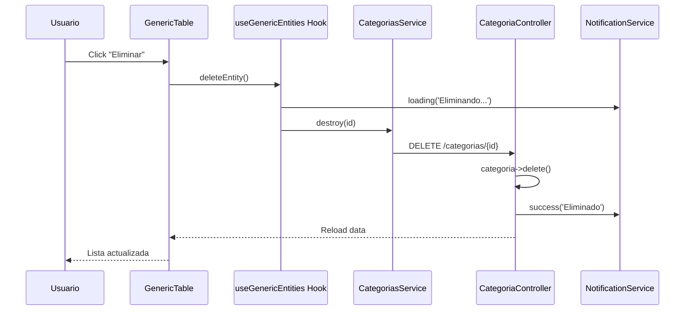
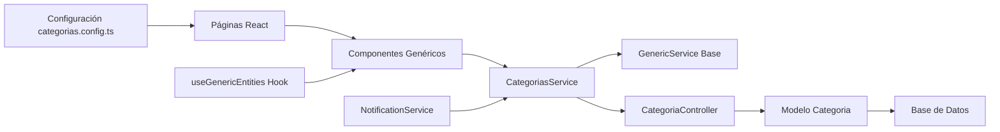

# Diagrama de Flujo de Trabajo - Sistema de Categorías

## Arquitectura General del Sistema

## Flujo Detallado de Operaciones CRUD

### 1. Listado de Categorías (READ)

### 2. Búsqueda de Categorías

### 3. Creación de Categoría (CREATE)

### 4. Edición de Categoría (UPDATE)

### 5. Eliminación de Categoría (DELETE)

## Componentes y Responsabilidades

### Frontend (React/TypeScript)

#### 1. **Páginas (Pages)**
- `index.tsx`: Página principal de listado
- `form.tsx`: Página de formulario (crear/editar)

#### 2. **Componentes Genéricos**
- `GenericContainer`: Contenedor principal con tabla y búsqueda
- `GenericFormContainer`: Manejo de formularios
- `GenericTable`: Tabla de datos con acciones
- `GenericSearchBar`: Barra de búsqueda
- `GenericPagination`: Paginación

#### 3. **Servicios**
- `CategoriasService`: Servicio específico que extiende `GenericService`
- `GenericService`: Clase base con operaciones CRUD comunes
- `NotificationService`: Manejo de notificaciones

#### 4. **Configuración**
- `categorias.config.ts`: Configuración de campos, validaciones, etc.

#### 5. **Hooks Personalizados**
- `useGenericEntities`: Lógica de estado y operaciones

### Backend (Laravel/PHP)

#### 1. **Controladores**
- `CategoriaController`: Maneja todas las operaciones CRUD
  - `index()`: Listado con filtros y paginación
  - `create()`: Formulario de creación
  - `store()`: Guardar nueva categoría
  - `edit()`: Formulario de edición
  - `update()`: Actualizar categoría
  - `destroy()`: Eliminar categoría

#### 2. **Modelos**
- `Categoria`: Modelo Eloquent con definición de campos y relaciones

#### 3. **Validaciones**
- Validación en controlador usando `$request->validate()`
- Validación frontend en el servicio

## Flujo de Datos

## Características del Sistema

### 1. **Arquitectura Genérica**
- Componentes reutilizables para diferentes módulos
- Servicios base con operaciones CRUD comunes
- Configuración centralizada por módulo

### 2. **Comunicación Frontend-Backend**
- Uso de Inertia.js para SPA con Laravel
- Router de Inertia para navegación
- Manejo de estado reactivo

### 3. **Características de UX**
- Búsqueda en tiempo real
- Paginación automática
- Notificaciones de feedback
- Loading states
- Validación client-side y server-side

### 4. **Patrón de Diseño**
- Service Layer Pattern
- Generic/Template Pattern
- Observer Pattern (para notificaciones)
- MVC Pattern (Laravel backend)

Este diagrama muestra cómo el sistema de categorías implementa una arquitectura limpia y escalable, donde cada capa tiene responsabilidades bien definidas y la comunicación fluye de manera ordenada desde el frontend hasta la base de datos.
